# APP-LB-RoundRobin

Descripción
-----------
Aplicación que implementa un cliente web, un `LoadBalancer` (Round-Robin) y un conjunto de réplicas `Backend` que procesan mensajes. El proyecto incluye código Java (Spring Boot) para el balanceador y el backend, y orquestación local con `docker-compose`.

Arquitectura
-----------
- Cliente web (frontend): página estática que envía peticiones al `LoadBalancer`.
- Load Balancer: servicio REST que implementa Round-Robin y reenvía peticiones a instancias `Backend`.
- Backend: instancias Spring Boot que exponen API y forman un cluster para compartir estado (ReplicatedMap / JGroups).

Diagrama
--------


Requisitos
---------
- Java 8 o superior
- Maven
- Docker (opcional para despliegue local)
- Docker Compose (opcional)
- Git
- (Para despliegue en AWS) AWS CLI y/o acceso al panel AWS, permisos para EC2

Despliegue - Local
------------------
1. Compilar el proyecto desde la raíz:

```bash
mvn clean package
```

2. Ejecutar servicios localmente (dos opciones):

- Usando Maven (desde cada módulo):

  - Backend:
    ```bash
    cd backendservice
    mvn spring-boot:run
    ```

  - LoadBalancer:
    ```bash
    cd loadbalancer
    mvn spring-boot:run
    ```

- Usando Docker Compose (levanta todos los servicios definidos en `docker-compose.yml`):


```bash
cd $(pwd) # desde la raíz del repo
 docker compose build --no-cache
```
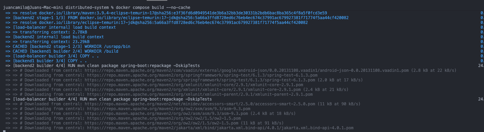

```bash
docker-compose up -d
```
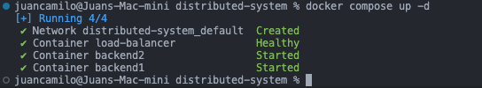


3. Verificar:

```bash
docker ps
curl http://localhost:8080/
```
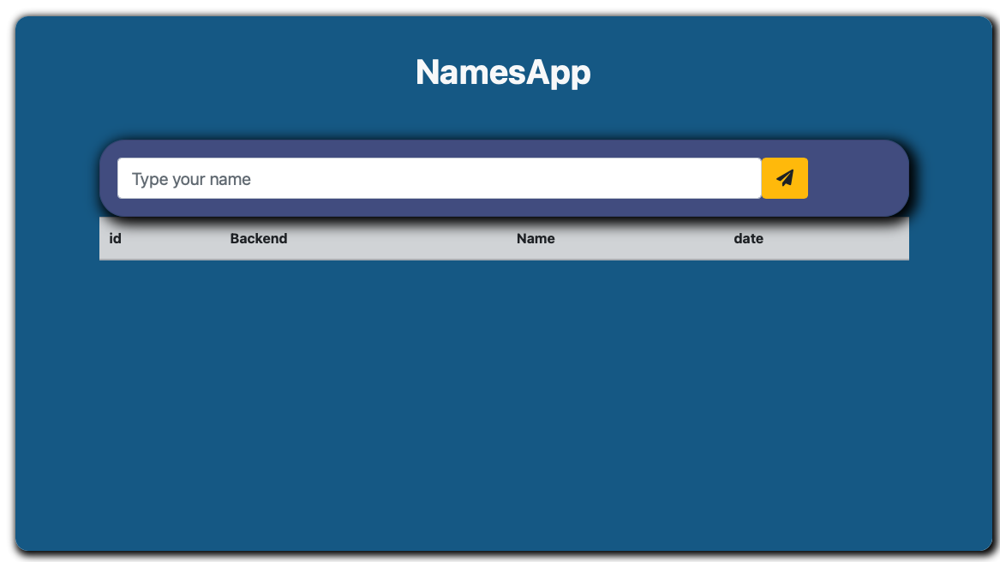
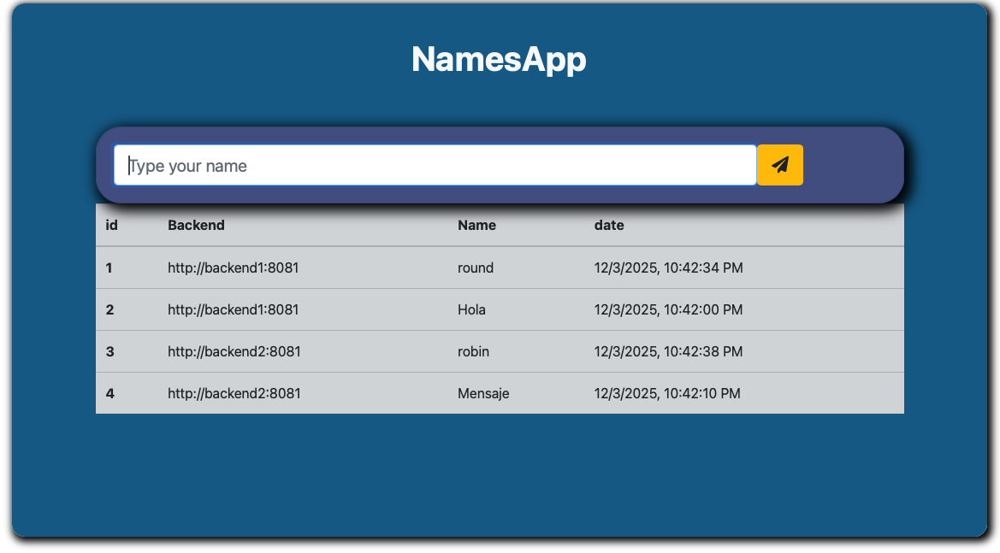

Notas:
- Ajusta `loadbalancer/src/main/resources/application.properties` si necesitas cambiar puertos o `loadbalancer.url`.
- Para pruebas de replicación (ReplicatedMap) ejecuta varias instancias del `backendservice` en máquinas o contenedores distintos.


Despliegue - AWS (EC2)
-----------------------------------------
Este proyecto puede desplegarse en EC2 con un Application frente a las instancias backend. A continuación los pasos y consideraciones importantes.

1) Construir y subir imágenes Docker

```bash
# Ejemplo: construir imagen del backend
cd backendservice
docker buildx build --platform=linux/amd64 -t myrepo/backendservice:latest --push .

# Repetir para loadbalancer
```
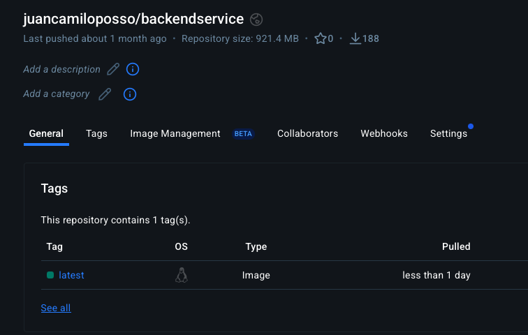
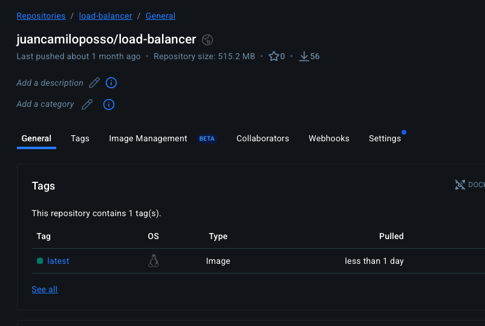

2) Redes y Security Groups

- Crea una VPC con subredes privadas para los backends y una subred pública para el Load Balancer si el cliente es público.

Security Group del Load Balancer: permite inbound HTTP/HTTPS desde Internet (o desde la red origen del cliente).
Para el **Load Balancer**, el Security Group:
  Inbound Rules:

    1. Type: Custom TCP
      Port: 7800-7802
      Source: [Security Group ID de los backends - mismo grupo]
      Description: JGroups cluster communication

    2. Type: Custom TCP
      Port: 8080
      Source: [Security Group ID del Load Balancer]
      Description: HTTP from Load Balancer

    3. Type: SSH
      Port: 22
      Source: [Tu IP o 0.0.0.0/0]
      Description: SSH access

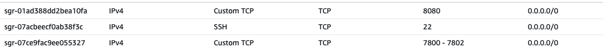

Security Group de Backends: permite inbound desde el SG del Load Balancer en el puerto de la aplicación (ej. `8081`) y permite tráfico entre miembros del SG en los puertos usados por JGroups (ej. `7800` TCP).

Para el **Backend**, el Security Group:
  Inbound Rules:

    1. Type: HTTP
      Port: 8081
      Source: 0.0.0.0/0
      Description: Public HTTP access

    2. Type: SSH
      Port: 22
      Source: [Tu IP]
      Description: SSH access

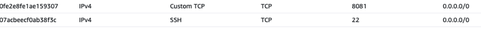

3) Descubrimiento y JGroups (ReplicatedMap)

- Para evitar multicast en AWS. Se configuro `jgroups.xml` para usar `TCP` y descubrimiento unicast (`TCPPING`).

Pruebas Funcionamiento AWS
-------------------

-Para el balanceador de carga procedemos a descargarlo del docker hub y ejecutamos en puerto 8080 con el siguiente comando:

```
docker run -d -p 8080:8081 --name backendservice juancamiloposso/backendservice
```

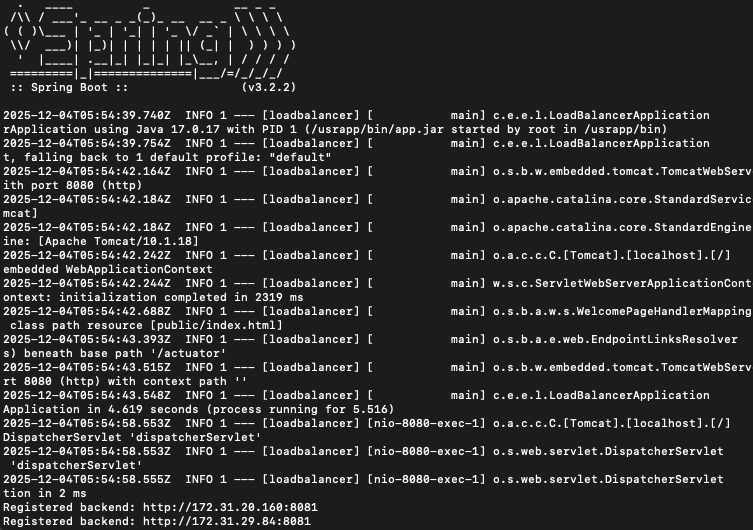

- Y para los servicios backend que necesitemos usamos el siguiente comando el cual contiene las variables de entorno solicitadas en el `application.properties` .Ponemos la IP de la maquina EC2 que estemos usando , en este caso `172.31.20.160` y el resto lo mantenemos igual:

```
docker run -d   --name backend1   -p 8081:8081   -p 7800:7800   -e SERVER_PORT=8081   -e PUBLIC_IP=172.31.20.160   -e jgroups.bind_addr=site_local   -e LOADBALANCER_URL=http://172.31.28.47:8080   -v $(pwd)/jgroups.xml:/usrapp/bin/jgroups.xml   juancamiloposso/backendservice
```
- backend 1:
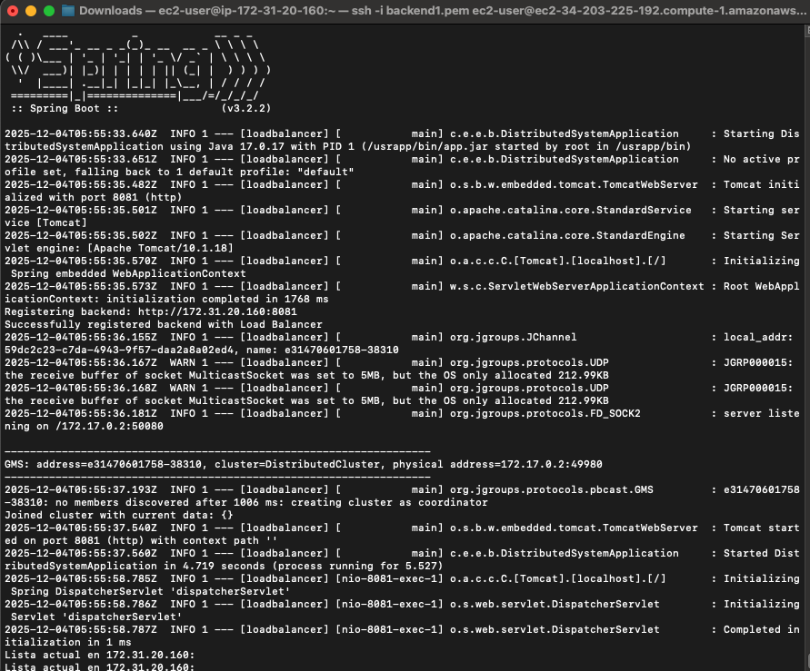
- backend 2:
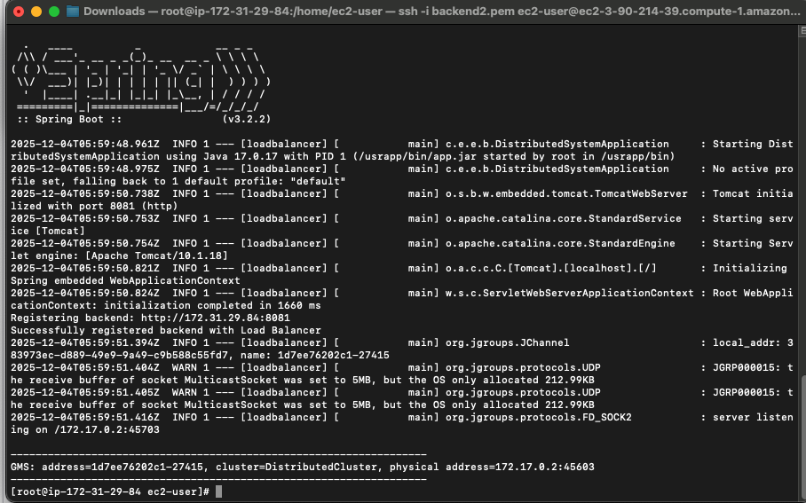

- Teniendo desplegado los backends que necesitemos, revisamos en navegador para ello, usamos la url a la maquina ec2 donde tenemos el ciente js que es la misma maquina donde tenemos el load balancer en el puerto 8080:
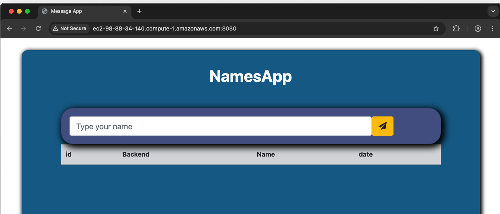
- Comprobamos que efectivamente los mensajes se distribuyan a los distintos backend que tengamos registrados en el load balancer
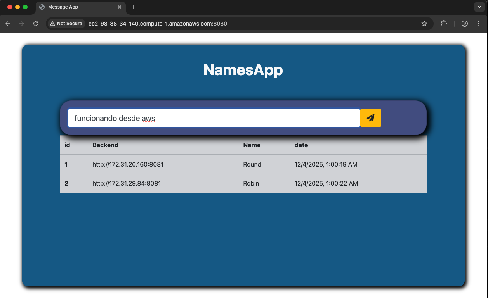


Archivos importantes
-------------------
- `docker-compose.yml` — orquesta los servicios para despliegue local.
- `loadbalancer/` — código del balanceador (round-robin). Revisar `application.properties` para variables como `loadbalancer.url`.
- `backendservice/` — servicio backend y configuración de JGroups/ReplicatedMap.

Autor
-----
Juan Camilo Posso Guevara
