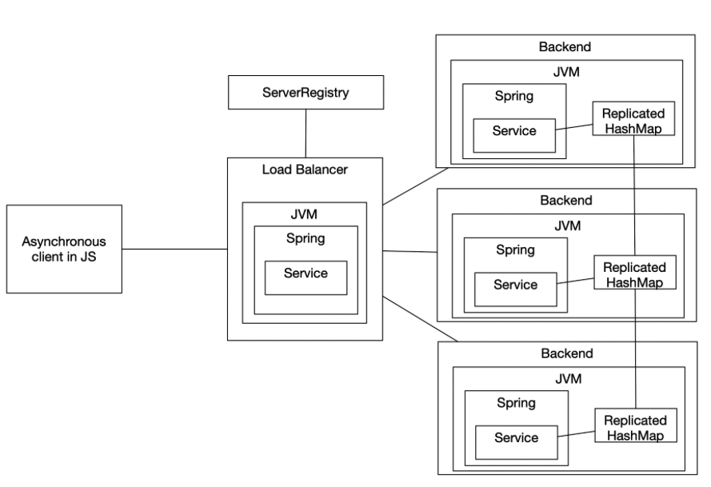

# APP-LB-RoundRobin

Descripción
-----------
Aplicación web APP-LB-RoundRobin que incluye un cliente web y un servicio REST encargado de balanceo de carga por Round-Robin. El cliente envía mensajes (texto) al servicio REST y presenta la respuesta JSON que recibe. El servicio REST delega el procesamiento en instancias de LogService (varias réplicas), recorriéndolas con un algoritmo Round-Robin.

Arquitectura
-----------
- Cliente web (frontend): página estática que envía peticiones al Load Balancer.
- Load Balancer (APP-LB): servicio REST que implementa Round-Robin y reenvía peticiones a las instancias del backend.
- Backend: servicio que procesa la petición y guarda/retorna logs.

Diagrama
---------------------

- Cliente web -> Load Balancer -> Backend Instance 1
                              -> Backend Instance 2
                              -> Backend Instance 3



Requisitos previos
------------------
- Java 8 (u 8 compatible)
- Maven
- Docker
- Docker Compose
- Git

Instalación y compilación
-------------------------
Desde la raíz del proyecto:

```bash
mvn clean install
mvn package
```

Ejecutar (modo desarrollo / compilado)
-----------------------------------
Para compilar y ejecutar con Maven:

```bash
mvn compile
mvn spring-boot:run
```

Despliegue con Docker Compose (localhost)
-----------------------------------------
El proyecto incluye un `docker-compose.yml` en la raíz. Para levantar los servicios localmente:

```bash
# en macOS (zsh)
cd /path/to/distributed-system
docker-compose up -d
```

Comprobar contenedores e imágenes:

```bash
docker ps
docker images
```

Despliegue en AWS
-------------------------------
1. Construir imágenes Docker y taggearlas para Docker Hub.
2. Push de imágenes a Docker Hub.
3. Crear una instancia EC2 y abrir puertos necesarios (35000, 35001, 35002, 35003, 27017 si usa MongoDB).
4. En la instancia EC2 instalar Docker y ejecutar `docker run -d -p <host_port>:<container_port> <imagen>` o desplegar con `docker-compose`.


Pruebas y verificación
----------------------
- Accede al cliente web en `http://<HOST_IP>:35000` (ajusta puerto según `docker-compose.yml`).
- Envía un mensaje desde la interfaz. Verifica en la respuesta JSON que el mensaje fue procesado y que el Load Balancer distribuye llamadas entre instancias (puedes observar logs o respuesta para ver qué instancia contestó).

Ejemplos de comandos útiles
--------------------------

```bash
# Ver logs del contenedor del balanceador
docker logs -f <container_name_or_id>

# Detener y eliminar contenedores creados por docker-compose
docker-compose down
```

Evidencias / Capturas
---------------------

- Evidencia: Interfaz cliente / captura
  

- Evidencia: Docker ps / containers
  

Archivos importantes
--------------------
- `docker-compose.yml` — orquesta los servicios para despliegue local.
- `loadbalancer/` — código del balanceador (round-robin).
- `backendservice/` — servicio backend (LogService) y su lógica.

Autor
-----
Juan Camilo Posso Guevara

Licencia
--------
Licencia bajo GNU General Public License.
